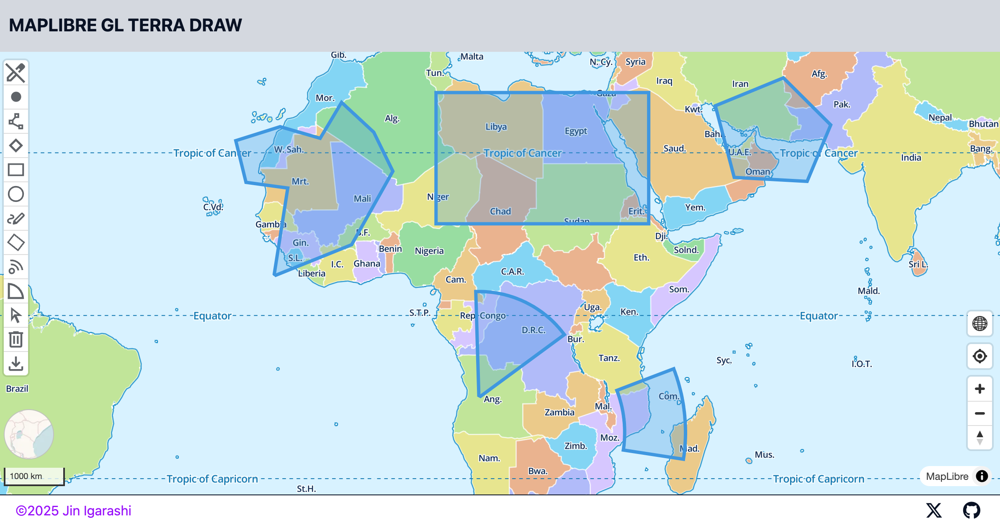
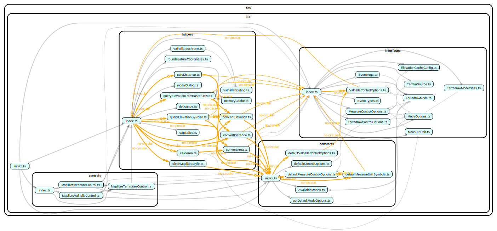

# maplibre-gl-terradraw


[](https://www.npmjs.com/package/@watergis/maplibre-gl-terradraw)
[](https://github.com/watergis/maplibre-gl-terradraw/actions/workflows/ci.yml)
[](https://github.com/watergis/maplibre-gl-terradraw/actions/workflows/release.yml)



This plugin is to add controls to your MapLibre for drawing powered by [Terra Draw](https://github.com/JamesLMilner/terra-draw) library.

## Install

```shell
npm i -D @watergis/maplibre-gl-terradraw
```

## Usage

See the [documentation](https://terradraw.water-gis.com/).

## Plugin API

See the [API documentation](https://watergis.github.io/maplibre-gl-terradraw/).



## Use cases

These projects are using `maplibre-gl-terradraw` and can be used as examples:

| Name          | Website                                                                | Source code                                        |
| ------------- | ---------------------------------------------------------------------- | -------------------------------------------------- |
| Cartes.app    | [cartes.app](https://cartes.app)                                       | [GitHub](https://github.com/cartesapp/cartes)      |
| Open Hinata 3 | [kenzkenz.xsrv.jp/open-hinata3](https://kenzkenz.xsrv.jp/open-hinata3) | [GitHub](https://github.com/kenzkenz/open-hinata3) |
| UNDP GeoHub   | [geohub.data.undp.org](https://geohub.data.undp.org/)                  | [GitHub](https://github.com/UNDP-Data/geohub)      |

Please feel free to make a PR to add your project here!

## Dependencies

This plugin depends the following libraries:

- [Terra Draw](https://github.com/JamesLMilner/terra-draw): core library for drawing features
- [maplibre-gl-js](https://github.com/maplibre/maplibre-gl-js): map library for the plugin
- [Turf](https://github.com/Turfjs/turf): It is used for measuring functionalities (area, distance, centroid).
- [Google fonts](https://fonts.google.com/icons): using some icons for the plugin buttons

## Contribution

See [CONTRIBUTING](./CONTRIBUTING.md)

## Lisence

This plugin is licensed under [MIT License](./LICENSE).
